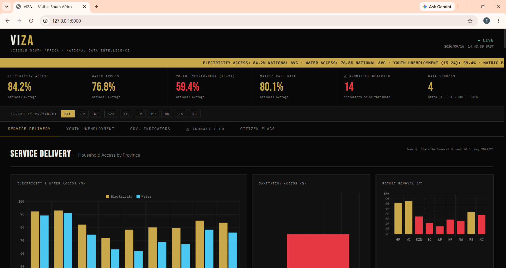

# ViZA - Visible South Africa 🇿🇦

> *A national data intelligence concept that makes South Africa's challenges visible and trackable, so they can be solved.*

**ViZA** is a portfolio project I built as a proof-of-concept for a real change initiative I proposed in my 2026 AFRIKA KOMMT! fellowship application. I didn't get the fellowship, but I figured I'd still build the idea and share it on GitHub. It explores what a national data intelligence layer could look like for South Africa: connecting government data sources that normally sit in silos, and surfacing the insights in one place.

---

## What it does

| Feature | Description |
|---|---|
| **Service Delivery Dashboard** | Tracks household access to electricity, water, sanitation and refuse removal by province |
| **Youth Unemployment Monitor** | Shows unemployment rates for ages 15-24 and 25-34, plus NEET rates |
| **Government Indicators** | Matric pass rates, school dropout rates, clinic access distances, crime index |
| **Anomaly Detection** | Flags provinces that fall noticeably below the national average |
| **Citizen Flag System** | Lets citizens report incorrect data. Each submission is logged in a public audit trail |
| **Province Filter** | All panels update when a province is selected |

---

## Tech Stack

- **Backend:** Python, FastAPI, Pydantic
- **Frontend:** Vanilla HTML, CSS and JavaScript, Chart.js
- **Data:** Simulated. Modelled on public indicators from Stats SA, DBE, DHIS and SAPS.

---

## Run locally

**1. Clone the repo**
```bash
git clone https://github.com/NNNkosi-dev/ViZA.git
cd ViZA
```

**2. Create and activate a virtual environment**
```bash
python -m venv .venv

# Windows (PowerShell):
.venv\Scripts\Activate.ps1

# macOS / Linux:
source .venv/bin/activate
```

**3. Install dependencies**
```bash
pip install -r backend/requirements.txt
```

**4. Start the server**
```bash
cd backend
uvicorn main:app --reload --port 8000
```

**5. Open in your browser**
```
http://127.0.0.1:8000
```

The FastAPI backend serves both the API and the frontend, so there's no separate frontend server to start.

---

## Project structure

```
viza/
├── backend/
│   ├── main.py              # FastAPI app and API routes
│   ├── requirements.txt
│   └── data/
│       ├── service_delivery.json
│       ├── unemployment.json
│       ├── indicators.json
│       └── flags.json       # Citizen-submitted flags (created at runtime)
└── frontend/
    ├── index.html
    ├── style.css
    └── app.js
```

---

## Background

ViZA was inspired by Estonia's X-Road, the system that helped enable fully digital government services there. I wanted to explore what a similar idea could look like in a South African context, where the challenge isn't a lack of data, but that the data sits in disconnected systems the public can't easily see into.

The long-term idea is to eventually add an intelligence layer that could surface patterns and anomalies automatically. For now, this project is the first step: a working prototype that pulls several data sources together into a single dashboard.

---

## Author

**Nompumelelo N. Nkosi**  
Aspiring Software Developer, Southern Labs Institute of Technology  
[LinkedIn](https://linkedin.com/in/nompumelelonkosi/) | [GitHub](https://github.com/NNNkosi-dev)

---

*All data in this prototype is simulated for demonstration purposes. Figures are modelled on public indicators from Statistics South Africa (Stats SA), the Department of Basic Education (DBE), the District Health Information System (DHIS), and the South African Police Service (SAPS).*
